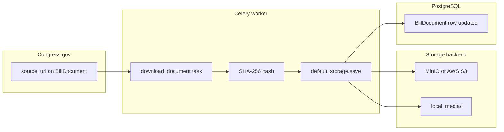

# File storage — how it works

This document explains **where bill document files live**, **how they get there**, and **which settings control behavior**. You don’t need to be a storage expert; the stack is standard Django + S3-compatible APIs.

---

## The big picture

1. **Congress.gov** gives us **URLs** to bill text (PDF, XML, HTML, etc.) when we ingest metadata (`process_bill_versions` creates **`BillDocument`** rows with `source_url`).
2. A **Celery** background task **`download_document`** downloads those bytes over **HTTPS** (`requests`).
3. We compute a **SHA-256** hash of the file. If it matches what we already stored, we **skip re-upload** (same content).
4. Otherwise we **upload** the file through **Django’s file storage API** (`default_storage.save(...)`). Behind that API is either:
   - **MinIO** (local, free, same API as Amazon S3), or  
   - **Amazon S3** (cloud, paid in production), or  
   - **Local disk** (`local_media/`) if you opt out of object storage entirely.
5. We save the storage **key** (path) and metadata on **`BillDocument`**: `object_storage_key`, `file_size_bytes`, `content_hash`, optional `extracted_text`, `downloaded_at`, etc.

So: **URLs in → bytes in memory → object storage (or disk) → database row updated.**

---

## The technologies (names you’ll see)

| Piece | Role |
|--------|------|
| **Django `STORAGES`** | Django 4.2+ setting that picks the **default** storage backend for `default_storage`. |
| **django-storages** | Third-party package that adds an **S3 backend** (`S3Boto3Storage`) so Django can talk to S3-compatible APIs. |
| **boto3** | AWS SDK for Python; used to talk to **S3** and **MinIO** (MinIO implements the S3 API). |
| **MinIO** | A small server you run locally (e.g. **Docker**) that behaves like **S3** but costs **nothing** for dev. |
| **Celery** | Runs **`download_document`** in a worker process so downloads/uploads don’t block the web server. |

Nothing here is “custom file magic” — it’s Django’s standard abstraction + either S3 or a folder on disk.

---

## Configuration (environment variables)

| Variable | Purpose |
|----------|---------|
| `USE_LOCAL_DOCUMENT_STORAGE` | `True` = save files under `local_media/` on disk (**no MinIO/S3**). `False` = use S3-compatible storage (MinIO or AWS). |
| `AWS_STORAGE_BUCKET_NAME` | Bucket name (e.g. `legislation-tracker-documents`). |
| `AWS_ACCESS_KEY_ID` / `AWS_SECRET_ACCESS_KEY` | Credentials. For MinIO defaults, use `minioadmin` / `minioadmin` in dev. |
| `AWS_S3_ENDPOINT_URL` | **MinIO:** `http://localhost:9000`. **Real AWS:** leave **empty** or unset so boto3 uses the real AWS endpoints. |
| `AWS_S3_REGION_NAME` | e.g. `us-east-1` (needed for some AWS create-bucket flows). |
| `AWS_S3_ADDRESSING_STYLE` | `path` for MinIO (often required). |

See **`.env.example`** in the backend root for copy-paste defaults.

---

## Three ways to run storage

### 1. MinIO (recommended for local dev — free)

- Start: `docker compose up -d minio` from `legislation-tracker-backend/`.
- MinIO API: `http://localhost:9000` · Console UI: `http://localhost:9001`.
- Set `AWS_S3_ENDPOINT_URL=http://localhost:9000` and the default minio credentials in `.env`.
- The **`download_document`** task **creates the bucket** if it doesn’t exist (via `boto3`).
- Files appear in the bucket under keys like:  
  `bills/{session}/{bill_number}/{version_label}.pdf`.

### 2. Local filesystem only (no Docker for storage)

- Set `USE_LOCAL_DOCUMENT_STORAGE=True`.
- Files are written under **`local_media/`** (ignored by git). Same Celery task; Django uses **FileSystemStorage** instead of S3.

### 3. Production AWS S3

- **Unset** `AWS_S3_ENDPOINT_URL` (or leave empty).
- Use **real** AWS access keys and a bucket in your account/region.
- **django-storages** + **boto3** talk to real S3; no code change beyond env and IAM permissions.

---

## Code layout (where to look)

| Location | What it does |
|----------|----------------|
| `config/settings/base.py` | Defines `STORAGES` (S3 vs filesystem) from env. |
| `apps/ingestion/document_download.py` | HTTP download, hashing, PDF/XML text extraction, optional bucket creation, `default_storage.save`. |
| `apps/ingestion/tasks.py` | **`download_document`** Celery task (orchestrates bounded download → upload → DB fields → enqueues deterministic legal-NLP v2 contract generation). |
| `apps/legislation/models.py` | **`BillDocument`** holds `source_url`, `object_storage_key`, `content_hash`, etc. |

---

## Flow diagram

---

## Troubleshooting

| Symptom | Things to check |
|--------|------------------|
| Connection refused to `:9000` | Is MinIO running? `docker compose up -d minio` |
| Access denied / 403 | Keys and bucket name match MinIO console; `AWS_S3_ADDRESSING_STYLE=path` for MinIO |
| Files not appearing | Celery worker running? Task `download_document` must execute (check worker logs) |
| `USE_LOCAL_DOCUMENT_STORAGE` but nothing on disk | Path is `legislation-tracker-backend/local_media/` (relative to project); check permissions |

---

## Related docs

- Short checklist: [PHASE_4_STORAGE.md](PHASE_4_STORAGE.md) (legacy pointer; prefer this file).
- Main backend README: [../README.md](../README.md) (quick MinIO blurb + links).
