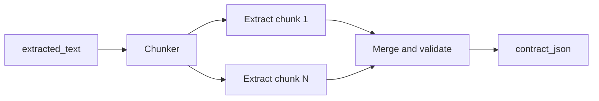

# Phase 5.3 — Schema, extraction pipeline, and evidence (plan)

This document expands **Phase 5.3** from [PHASE_5_CONTRACT.md](PHASE_5_CONTRACT.md): a **versioned `contract_json` schema**, how to **fill it** (LLM / classical / hybrid + **chunk → extract → merge**), and how **`EvidenceSpan`** rows anchor claims to **`BillDocument.extracted_text`**.

Implementation still uses the same tables: **`BillContract`**, **`EvidenceSpan`** ([`apps/legislation/models.py`](../apps/legislation/models.py)). No new models are required for the core design.

---

## 1. Versioned schema (`schema_version` + `contract_json`)

### 1.1 Principles

- **`BillContract.schema_version`** (CharField) matches the **contract JSON contract** used for that row (e.g. `1.0-stub`, `2.0-nlp`).
- **Renaming or removing fields** should **bump** the schema version so API consumers and analytics can branch on `schema_version`.
- **Hashing** stays on the full `contract_json` dict via [`contract_hash_from_dict`](../apps/legislation/contract_json.py); changing schema shape changes hashes as expected.
- Optionally add a **`JSON Schema`** file in-repo (e.g. `apps/legislation/schemas/contract_v2.json`) and validate after extraction **before** persisting.

### 1.2 Current stub (`1.0-stub`)

Today’s keys (see [`tasks.py`](../apps/legislation/tasks.py)):

| Key | Role |
|-----|------|
| `schema_version` | Literal `1.0-stub` (also mirrored on the model) |
| `title` | From `Bill.title` |
| `plain_summary` | Short excerpt-derived text |
| `source_excerpt` | Longer excerpt |
| `version_label` | From `BillDocument.version_label` |

### 1.3 Target schema (example `2.0-nlp`)

This is a **product-shaped** example; names can change as long as you **version** and document.

**Top-level groups (stable ordering helps hashing; `contract_json` normalization already sorts keys):**

| Area | Suggested keys | Notes |
|------|----------------|--------|
| **Meta** | `schema_version`, `version_label` | `schema_version` inside JSON can duplicate the model field for self-contained payloads. |
| **Audience summary** | `plain_summary` | 1–3 short paragraphs in plain language. |
| **Structure** | `key_provisions` | **Array** of objects, e.g. `{ "heading": "...", "plain_text": "...", "citation_label": "Sec. 101" }`. |
| **Money / time** | `funding_items`, `timeline_items` | Arrays of small structured objects (amount, fiscal year, effective date) — only if extraction can support them reliably. |
| **Definitions** | `definitions` | Array of `{ "term": "...", "plain_definition": "..." }` from bill “definition” sections. |
| **Scope / limits** | `applicability_summary` | Optional string: who/where/when the bill applies. |

**Rules of thumb:**

- Prefer **arrays of objects** over huge nested trees so **EvidenceSpan** can target `key_provisions[3].plain_text` style paths.
- Keep **numbers and dates** in **normalized** forms (ISO dates, decimal amounts) for stable hashing — align with `normalize_value` in `contract_json.py`.
- **Do not** store redundant full bill text inside JSON; that belongs in `extracted_text`.

### 1.4 Schema evolution

- **Additive minor** (new optional keys): may stay on `2.0-nlp` or bump to `2.1-nlp` if clients need to detect new fields.
- **Breaking** (rename/remove): new major, e.g. `3.0-nlp`.
- Document each version in this file and in release notes.

---

## 2. Extraction approaches (not prescribed)

Choose based on **quality**, **cost**, **latency**, and **compliance** (data leaving your network).

| Approach | When it fits | Tradeoffs |
|----------|----------------|-----------|
| **Hosted LLM** (OpenAI, Anthropic, etc.) | Fast to good summaries + JSON mode / tool schema | Cost, rate limits, data policy |
| **Smaller open weights** (local / VPC) | Control + privacy | GPU ops, model choice, eval |
| **Classical NLP** (spaCy NER, rules, section split) + **templates** | Predictable, cheap | Weaker paraphrase; more engineering |
| **Hybrid** | Section detection (rules/ML) + LLM per section | Balance of cost and quality |

**Structured output:** Prefer **JSON Schema** or **tool/function** calling so the model returns parseable objects; validate and **retry** on failure.

---

## 3. Chunk → extract → merge (long bills)

Full bill text often exceeds a single model context window or degrades quality if stuffed into one prompt.



### 3.1 Chunking strategies

- **By size** — Fixed character windows with overlap (e.g. 8k chars, 500 overlap) to avoid cutting entities at boundaries.
- **By structure** — If extraction pipeline can detect **sections** (ALL CAPS headers, “SEC. 101”, XML structure from bill XML), chunk on boundaries first; better evidence alignment.
- **By page** — If `extracted_text` preserves **page breaks** (e.g. `\f` or `[Page 5]`), optional chunk-per-page for alignment with `page_number`.

### 3.2 Per-chunk extraction

- Input: chunk text + **global context** (bill title, chamber, version_label) to reduce hallucinations.
- Output: **partial** structures (e.g. `key_provisions` candidates, `funding_items` for this chunk only) **or** intermediate notes for a second pass.
- **Parallelism:** Independent chunks can run in parallel with **rate-limit** awareness.

### 3.3 Merge

- **Deduplicate** provisions (similar headings/text).
- **Order** provisions (section order, appearance in bill).
- **Resolve conflicts** (two chunks claim different amounts — second pass or heuristic).
- **Validate** full document against JSON Schema; **fill required fields** or mark extraction as partial / failed for observability.

---

## 4. EvidenceSpan specification

Model fields: `field_path`, `start_char`, `end_char`, `quoted_text`, `page_number` (optional). See [`EvidenceSpan`](../apps/legislation/models.py).

### 4.1 `field_path` grammar

- **Purpose:** JSON Pointer–like path into **`contract_json`**, as a single string (max **255** chars on the model).
- **Conventions:**
  - Nested keys: `plain_summary`, `applicability_summary`.
  - Arrays: **0-based** indices — `key_provisions[2].plain_text`, `definitions[0].term`.
  - **No dots inside segment names** if avoidable (use `snake_case` keys). If a key ever had a dot, define escaping or forbid such keys in schema.
- **Multiple spans:** Multiple rows **may** share the same `field_path` (e.g. several quotes supporting one provision). The UI can show “sources” for one field.

### 4.2 `start_char` / `end_char` (offsets into `extracted_text`)

- **Reference string:** `BillDocument.extracted_text` — the **same** UTF-8-decoded string used for extraction.
- **Index space:** **Python 3 string indices**: 0-based, end **exclusive**, so `extracted_text[start_char:end_char] == quoted_text` after normalization (see below).
- **Unicode:** Count **Unicode code points** (Python `str` indices), not UTF-8 byte offsets — document this for any non-Python consumer.
- **Validation before save:**
  - `0 <= start_char < end_char <= len(extracted_text)`
  - Optional: assert `quoted_text` matches slice (or normalize whitespace for comparison).

### 4.3 `quoted_text`

- Should be the **literal** substring (or a normalized whitespace variant clearly defined) so readers can verify against the bill.
- Length limits: model is `TextField`; practical cap (e.g. 2–4k chars) avoids huge rows.

### 4.4 `page_number`

- Populate only when the **PDF/text pipeline** provides a reliable **page → character range** map (Phase 4+ enhancement). If unknown, leave `null`.
- If chunking uses page boundaries, map chunk spans back to page indices during extraction.

### 4.5 Which fields get evidence

- **Minimum viable:** `plain_summary`, each `key_provisions[i].plain_text` (and optionally `heading`).
- **Optional:** definitions, funding lines — as quality allows.
- **Policy:** “Important fields” = any field you show prominently in the product and want to defend in UI; store at least one span per such field when the model returns offsets.

### 4.6 Extraction output shape (bridge to DB)

The NLP layer can return a list of evidence dicts alongside JSON:

```text
[
  {"field_path": "plain_summary", "start_char": 120, "end_char": 580, "quoted_text": "...", "page_number": null},
  {"field_path": "key_provisions[0].plain_text", "start_char": 1200, "end_char": 1450, "quoted_text": "...", "page_number": 2}
]
```

`generate_contract` creates **one `EvidenceSpan` per list entry** (after validation). Fields without offsets can omit evidence or use stub behavior until the model supplies spans.

---

## 5. Implementation sequence (suggested)

1. **Lock `2.0-nlp` JSON Schema** (or similar) and document it here.
2. **Implement chunker + merge utilities** with tests on synthetic long text.
3. **Implement extractor adapter** (one of: LLM, local model, hybrid) returning `{ contract_json, evidence_spans }`.
4. **Wire** into `generate_contract`: replace stub builder; validate; create spans; keep hash skip + ChangeLog + Celery hooks.
5. **Observability:** log token usage, failures, partial merges; optional feature flag `USE_STUB_CONTRACT` for dev without API keys.

---

## Related

- [PHASE_5_CONTRACT.md](PHASE_5_CONTRACT.md) — Phase 5 overview  
- [BACKEND_BUILD_STEPS.md](../../BACKEND_BUILD_STEPS.md) — checklist item 5.3  
- [FILE_STORAGE.md](FILE_STORAGE.md) — where `extracted_text` comes from  
