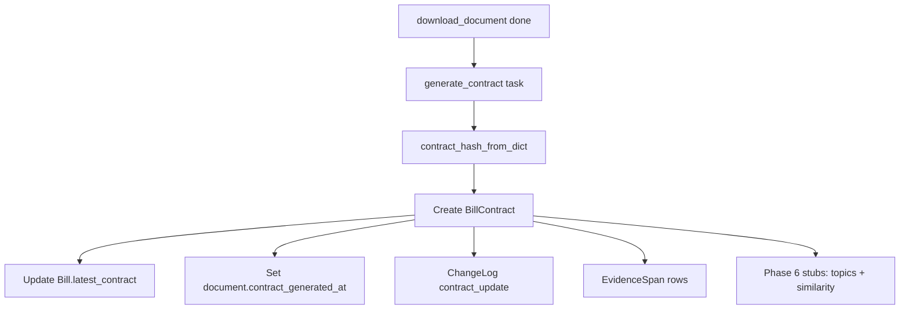

# Phase 5: Bill “contract” (plain-language interpretation)

This page explains **what a BillContract is**, **how we build one today**, and **how it connects to the rest of the system** — in everyday language, with the technical names called out so engineers can find the code.

---

## What problem does this solve?

A bill’s **official text** is long and written in legal language. The product’s goal is to offer a **structured, plain-language summary** people can read and trust — a **“contract”** view: what the bill does, in clear terms, with **evidence** pointing back to the source text.

Phase 5 adds the **first version** of that layer: we store a **JSON document** (`contract_json`) plus a **fingerprint** (`contract_hash`) so we know when the interpretation changed. Later phases can swap in **machine learning / NLP** without changing the database shape.

---

## The main ideas (non-technical)

| Idea | Plain English |
|------|----------------|
| **BillContract** | One row per “interpretation snapshot” of a **specific version** of a bill (linked to a **BillDocument**). |
| **contract_json** | A structured description (title, plain summary, key points, requirements, funding mentions, effective dates, etc.) stored as **JSON** in **PostgreSQL**. |
| **contract_hash** | A **SHA-256** fingerprint of the JSON after we **normalize** it (same content → same hash). |
| **EvidenceSpan** | For source-backed fields, we store an **exact quote**, its **field path**, and exact character offsets so we can show “where this came from” later. |
| **ChangeLog** | When the contract changes, we append an event (`contract_update`) for feeds and history. |
| **Celery** | **`generate_contract`** runs in the **background** after a document is downloaded so the web server stays fast. |

---

## Technologies used

| Layer | Technology |
|--------|------------|
| **Database** | **PostgreSQL** (via **Django ORM**) — `BillContract`, `EvidenceSpan`, `ChangeLog`. |
| **Task queue** | **Celery** + **Redis** — `generate_contract`, and stubs `update_topics`, `schedule_similarity_for_bill` for Phase 6. |
| **Hashing** | **SHA-256** over a **canonical JSON string** (sorted keys, normalized whitespace). |
| **Serialization** | **JSON** — Python `dict` → JSON-compatible structure; `json.dumps` with stable ordering. |

---

## How it works today (stub vs future)

### Today (Phase 5.2 deterministic contract)

1. **`download_document`** finishes and stores **`extracted_text`** (from PDF/XML when possible).
2. **`generate_contract(document_id)`** runs (Celery task in `apps/legislation/tasks.py`).
3. We build a deterministic **structured JSON contract** from:
   - the bill **title**,
   - a plain-language **summary** sentence,
   - **key points** from source sentences,
   - **requirements** detected from words such as `shall`, `must`, and `required`,
   - **funding mentions** detected from appropriations/funding/grant language,
   - **effective dates** detected from effect/enactment language,
   - **version label** (e.g. introduced / engrossed),
   - a short **source excerpt** for display compatibility.
4. We compute **`contract_hash`** using **`contract_json.canonical_json_string`** / **`contract_hash_from_dict`** in `apps/legislation/contract_json.py`.
5. If the **latest contract for this document** already has the **same hash**, we **skip** (nothing changed).
6. Otherwise we **create a new `BillContract`**, update **`Bill.latest_contract`**, set **`BillDocument.contract_generated_at`**, write **`ChangeLog`**, create **`EvidenceSpan`** rows only for fields whose quote can be validated against the source text, then enqueue **Phase 6** work: **`update_topics`** and **`schedule_similarity_for_bill`**.

### Later (Phase 5.3)

Replace the deterministic sentence/keyword builder with **real NLP** that fills `contract_json` and EvidenceSpans from the full text — **same tables**, richer content. **Detailed plan:** [PHASE_5_3_PLAN.md](PHASE_5_3_PLAN.md) (versioned schema, chunk → extract → merge, EvidenceSpan rules).

---

## Where to look in the code

| File | Purpose |
|------|---------|
| `apps/legislation/contract_json.py` | Canonical JSON string + hash for stable `contract_hash`. |
| `apps/legislation/tasks.py` | `generate_contract`, deterministic evidence-backed contract extraction, `update_topics`, `schedule_similarity_for_bill` (stub). |
| `apps/legislation/models.py` | `BillContract`, `EvidenceSpan`, `Bill.latest_contract`, `BillDocument.contract_generated_at`. |
| `apps/changelog/models.py` | `ChangeLog` with `change_type` including `contract_update`. |

---

## Flow diagram

---

## UI (bill detail)

The **Next.js** bill detail page (`/bills/[id]`) includes a **“Plain-language summary (beta)”** section fed by **`latest_contract`** on `GET /api/bills/{id}/` (nested `BillContract` + `evidence_spans`). If no contract exists yet, the section explains that **`generate_contract`** must run after document download.

## Related

- **Phase 4 (files):** [FILE_STORAGE.md](FILE_STORAGE.md)  
- **Build checklist:** [BACKEND_BUILD_STEPS.md](../../BACKEND_BUILD_STEPS.md) (repo root)
